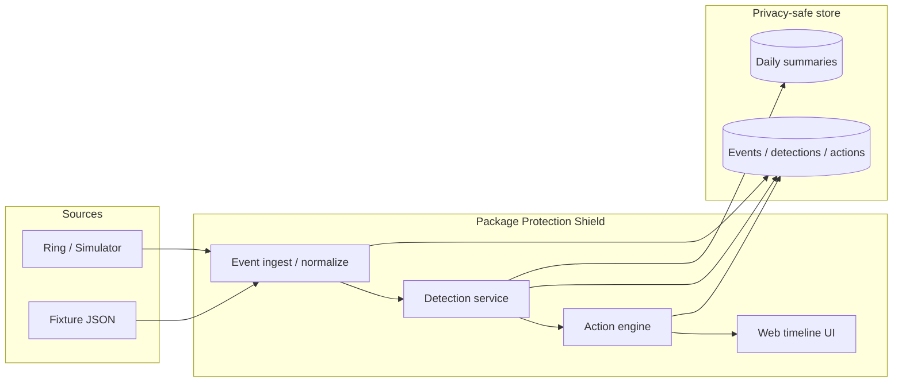
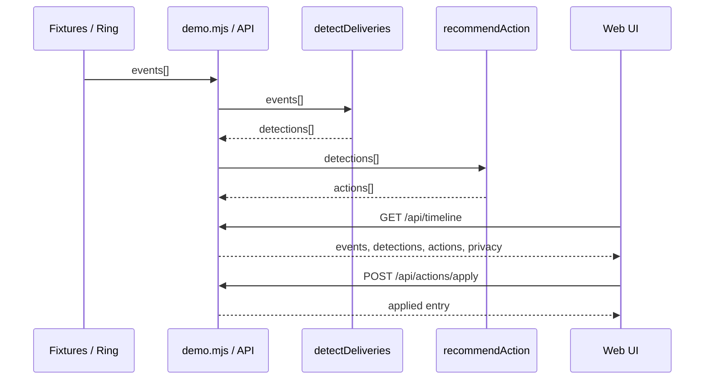
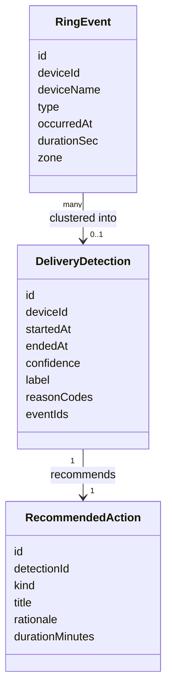
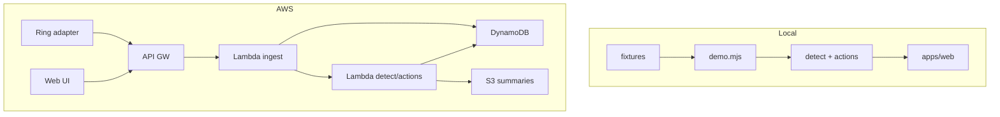
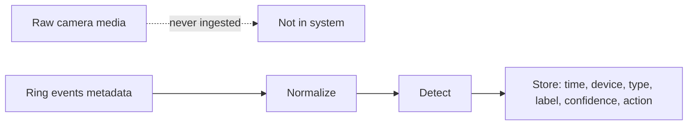

# Architecture — Package Protection Shield

Companion to [REQUIREMENTS.md](./REQUIREMENTS.md) and [LEARN.md](./LEARN.md).

---

## 1. Context diagram

**Idea:** same brain (detect + actions) whether events come from fixtures or Ring.

---

## 2. Sequence — delivery → action

---

## 3. Domain model (MVP)

---

## 4. Logical vs physical (local vs AWS)

| Logical piece | Local MVP | AWS Builder target |
|---------------|-----------|--------------------|
| Ingest | `scripts/demo.mjs` + fixtures | API Gateway + Lambda |
| Detect | `services/detect` | Lambda (same module) |
| Actions | `services/actions` | Lambda or inline |
| Timeline UI | `apps/web` | S3/CloudFront or same local UI hitting API |
| Event store | in-memory session | DynamoDB |
| Summaries | optional / derived | S3 JSON objects |

Keep **detect/actions as pure functions** so local and AWS stay aligned.

---

## 5. Privacy data flow

UI must surface the stored-field list when privacy mode is on.

---

## 6. Component ownership

| Component | Responsibility | Not responsible for |
|-----------|----------------|---------------------|
| `detect.mjs` | Delivery heuristics | UI, AWS, Ring OAuth |
| `actions.mjs` | Next-best action rules | Persistence |
| `demo.mjs` | HTTP + wiring | Business rules |
| `apps/web` | Presentation + Apply UX | Scoring |
| `infra/aws` | Cloud resources | Product heuristics |

---

## 7. Extension points (post-MVP)

- Ring adapter implementing “fetch events → `RingEvent[]`”
- Feedback API: `was_delivery: true|false`
- Device role config: `porch` vs `driveway`
- Deep-link mapper: action kind → Ring settings URL
